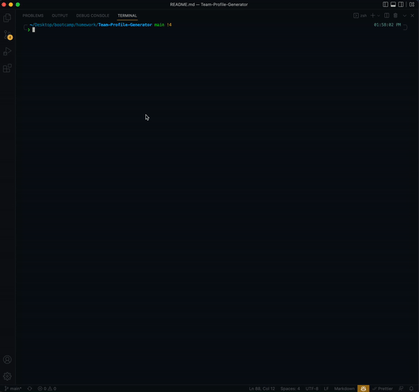
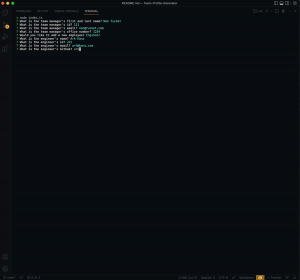

# Team Profile Generator

  Command-line application that will generate a profile for a team of sofware engineers. 

  [](https://opensource.org/licenses/MIT)

---

## Contents 🗒

1. [About](#about)
    1. [User Story](#user%20story)
    2. [Acceptance criteria](#acceptance%20criteria)
    3. [Project Preview](#project%20preview)
2. [Installation](#installation)
3. [Technologies](#technologies)
4. [License](#license)
5. [Contributing](#contributing)
6. [Authors and acknowledgment](#authors%20and%20acknowledgment)
7. [Contacts](#contacts)

---

## About 📋

This is a simple command-line application that help you organize and visualize your team.

---

## User Story 👩🏻‍🏫

```md
AS A manager
I WANT to generate a webpage that displays my team's basic info
SO THAT I have quick access to their emails and GitHub profiles
```

---

## Acceptance Criteria 🌈

```md
GIVEN a command-line application that accepts user input
WHEN I am prompted for my team members and their information
THEN an HTML file is generated that displays a nicely formatted team roster based on user input
WHEN I click on an email address in the HTML
THEN my default email program opens and populates the TO field of the email with the address
WHEN I click on the GitHub username
THEN that GitHub profile opens in a new tab
WHEN I start the application
THEN I am prompted to enter the team manager’s name, employee ID, email address, and office number
WHEN I enter the team manager’s name, employee ID, email address, and office number
THEN I am presented with a menu with the option to add an engineer or an intern or to finish building my team
WHEN I select the engineer option
THEN I am prompted to enter the engineer’s name, ID, email, and GitHub username, and I am taken back to the menu
WHEN I select the intern option
THEN I am prompted to enter the intern’s name, ID, email, and school, and I am taken back to the menu
WHEN I decide to finish building my team
THEN I exit the application, and the HTML is generated
```

---

## Project Preview 📸





---

## Installation 📀

  Clone repo, run npm init, install dependencies, run node

  To clone the repo:

    git clone 
    
    git@github.com:vynguyen205/Team-Profile-Generator.git

---

## Technologies 👩🏻‍🔧

- Javascript

---

## License 👮🏻‍♀️

  License used for this project - MIT
  * For more information on license types, please reference this website
  for additional licensing information - [https: //choosealicense.com/](https://choosealicense.com/).

---

## Contributing 💃🏻

To contribute to this application, create a pull request.
  Here are the steps needed for doing that:
  - Fork the repo
  - Create a feature branch (git checkout -b NAME-HERE)
  - Commit your new feature (git commit -m 'Add some feature')
  - Push your branch (git push)
  - Create a new Pull Request
  Following a code review, your feature will be merged.

---

## Links 🔗 

**[GitHub Link 🐱](https://github.com/vynguyen205/Team-Profile-Generator)**

<br>

**[Video Demo 👀](https://youtu.be/hTwL_jRUSe0)**

---

## Usage Instructions 💻

Once you clone the repo, you can start the application by doing "node index" in the terminal. After you answer the prompts you can check the generated html in the "dist folder".

---

## Authors and Acknowledgments ✨

Built by Vy Nguyen

---

## Contacts ☎️

- GitHub Username: [vynguyen205](https://github.com/vynguyen205)
- GitHub Email: vynguyen05202@gmail.com
  
